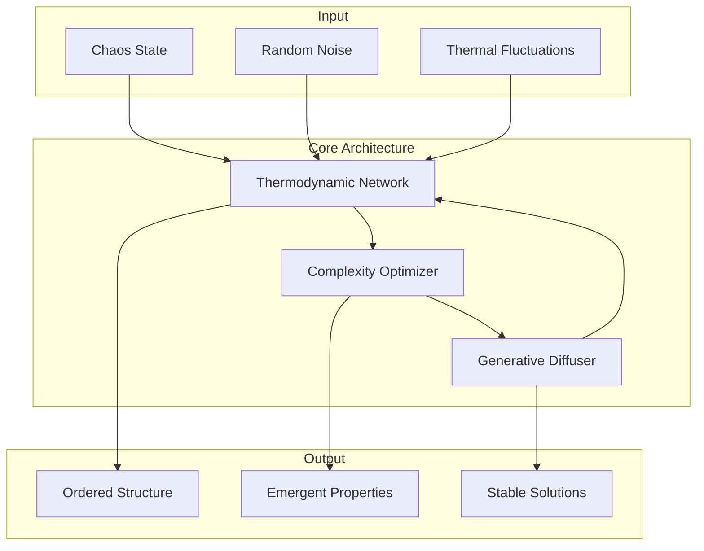

# Core Architecture

Entropic AI's core architecture implements thermodynamic neural networks that operate according to fundamental physical principles. This section provides detailed documentation of the core components that enable chaos-to-order evolution.

## Overview

The core architecture consists of three main components working in harmony:

1. **[Thermodynamic Networks](#thermodynamic-networks)**: Neural networks with energy, entropy, and temperature
2. **[Complexity Optimizers](#complexity-optimizers)**: Drives evolution toward emergent complexity
3. **[Generative Diffusion](#generative-diffusion)**: Orchestrates the chaos-to-order transformation



## Thermodynamic Networks

### ThermodynamicNode

The fundamental unit of computation in Entropic AI is the `ThermodynamicNode`, which maintains thermodynamic state variables.

#### State Variables

Each node maintains four key thermodynamic quantities:

```python
class ThermodynamicNode:
    def __init__(self, dimension: int):
        self.energy = 0.0           # Internal energy U
        self.entropy = 1.0          # Entropy S  
        self.temperature = 1.0      # Temperature T
        self.free_energy = 0.0      # Helmholtz free energy F = U - TS
```

#### Thermodynamic Forward Pass

The forward pass computes outputs while updating thermodynamic state:

```python
def thermodynamic_forward(self, x: torch.Tensor) -> torch.Tensor:
    """Forward pass with thermodynamic state evolution."""
    
    # Standard neural computation
    linear_output = torch.matmul(x, self.weight) + self.bias
    
    # Update internal energy based on activity
    self.energy = torch.mean(linear_output ** 2)
    
    # Compute entropy from activation distribution
    probabilities = torch.softmax(linear_output, dim=-1)
    self.entropy = -torch.sum(probabilities * torch.log(probabilities + 1e-8))
    
    # Calculate free energy
    self.free_energy = self.energy - self.temperature * self.entropy
    
    # Thermodynamic activation function
    output = self._thermodynamic_activation(linear_output)
    
    return output
```

#### Thermodynamic Activation Functions

Activation functions incorporate temperature effects:

```python
def _thermodynamic_activation(self, x: torch.Tensor) -> torch.Tensor:
    """Temperature-dependent activation function."""
    
    if self.activation_type == "boltzmann":
        # Boltzmann distribution activation
        return torch.exp(-x / (self.temperature + 1e-8))
        
    elif self.activation_type == "fermi_dirac":
        # Fermi-Dirac distribution activation  
        return 1.0 / (1.0 + torch.exp(-x / (self.temperature + 1e-8)))
        
    elif self.activation_type == "thermal_relu":
        # Temperature-modulated ReLU
        return torch.where(
            x > self.temperature,
            x - self.temperature,
            torch.zeros_like(x)
        )
```

### ThermodynamicNetwork

The `ThermodynamicNetwork` class orchestrates multiple thermodynamic nodes.

#### Network Architecture

```python
class ThermodynamicNetwork(nn.Module):
    def __init__(
        self,
        input_dim: int,
        hidden_dims: List[int],
        output_dim: int,
        temperature: float = 1.0,
        entropy_regularization: float = 0.1
    ):
        super().__init__()
        
        # Create thermodynamic layers
        self.layers = nn.ModuleList()
        dims = [input_dim] + hidden_dims + [output_dim]
        
        for i in range(len(dims) - 1):
            layer = ThermodynamicLayer(
                input_dim=dims[i],
                output_dim=dims[i+1], 
                temperature=temperature
            )
            self.layers.append(layer)
            
        self.entropy_regularization = entropy_regularization
```

#### Energy and Entropy Computation

```python
def compute_total_energy(self) -> float:
    """Compute total system energy."""
    total_energy = 0.0
    for layer in self.layers:
        for node in layer.nodes:
            total_energy += node.energy
    return total_energy

def compute_total_entropy(self) -> float:
    """Compute total system entropy."""
    total_entropy = 0.0
    for layer in self.layers:
        for node in layer.nodes:
            total_entropy += node.entropy
    return total_entropy

def compute_free_energy(self) -> float:
    """Compute Helmholtz free energy F = U - TS."""
    U = self.compute_total_energy()
    S = self.compute_total_entropy()
    T = self.get_average_temperature()
    return U - T * S
```

#### Temperature Dynamics

Temperature can evolve according to various schedules:

```python
def update_temperature(self, step: int, total_steps: int, schedule: str = "exponential"):
    """Update system temperature according to cooling schedule."""
    
    if schedule == "exponential":
        # Exponential cooling: T(t) = T₀ * exp(-t/τ)
        tau = total_steps / 3.0
        self.temperature = self.initial_temperature * np.exp(-step / tau)
        
    elif schedule == "linear":
        # Linear cooling: T(t) = T₀ * (1 - t/T_max)
        self.temperature = self.initial_temperature * (1.0 - step / total_steps)
        
    elif schedule == "power_law":
        # Power law cooling: T(t) = T₀ / (1 + t)^α
        alpha = 0.5
        self.temperature = self.initial_temperature / (1.0 + step) ** alpha
        
    # Update all layer temperatures
    for layer in self.layers:
        layer.temperature = self.temperature
```

### EntropicNetwork

The `EntropicNetwork` is a specialized thermodynamic network optimized for maximum entropy production.

#### Entropy Production Rate

```python
class EntropicNetwork(ThermodynamicNetwork):
    def __init__(self, *args, **kwargs):
        super().__init__(*args, **kwargs)
        self.entropy_production_history = []
        
    def compute_entropy_production_rate(self) -> float:
        """Compute rate of entropy production."""
        
        if len(self.entropy_production_history) < 2:
            return 0.0
            
        current_entropy = self.compute_total_entropy()
        previous_entropy = self.entropy_production_history[-1]
        
        entropy_production_rate = current_entropy - previous_entropy
        self.entropy_production_history.append(current_entropy)
        
        return entropy_production_rate
```

## Complexity Optimizers

### Base ComplexityOptimizer

The `ComplexityOptimizer` drives the system toward states of optimal complexity.

#### Complexity Metrics

```python
class ComplexityOptimizer:
    def __init__(
        self,
        method: str = "kolmogorov_complexity",
        target_complexity: float = 0.7,
        stability_weight: float = 0.3
    ):
        self.method = method
        self.target_complexity = target_complexity  
        self.stability_weight = stability_weight
        
    def compute_complexity_score(self, state: torch.Tensor) -> float:
        """Compute complexity score using specified method."""
        
        if self.method == "kolmogorov_complexity":
            return self._kolmogorov_complexity(state)
        elif self.method == "shannon_entropy":
            return self._shannon_entropy(state)
        elif self.method == "fisher_information":
            return self._fisher_information(state)
        elif self.method == "multi_objective":
            return self._multi_objective_complexity(state)
```

#### Kolmogorov Complexity Estimation

```python
def _kolmogorov_complexity(self, state: torch.Tensor) -> float:
    """Estimate Kolmogorov complexity using compression."""
    
    # Convert tensor to bytes
    state_bytes = state.detach().cpu().numpy().tobytes()
    
    # Compress using multiple algorithms
    import zlib, bz2, lzma
    
    zlib_compressed = zlib.compress(state_bytes)
    bz2_compressed = bz2.compress(state_bytes)
    lzma_compressed = lzma.compress(state_bytes)
    
    # Use minimum compression ratio
    original_size = len(state_bytes)
    min_compressed_size = min(
        len(zlib_compressed),
        len(bz2_compressed), 
        len(lzma_compressed)
    )
    
    # Complexity = 1 - compression_ratio
    compression_ratio = min_compressed_size / original_size
    complexity = 1.0 - compression_ratio
    
    return complexity
```

#### Fisher Information

```python
def _fisher_information(self, state: torch.Tensor) -> float:
    """Compute Fisher information as complexity measure."""
    
    # Treat state as probability distribution
    probabilities = torch.softmax(state.flatten(), dim=0)
    
    # Compute score function (gradient of log-likelihood)
    log_probs = torch.log(probabilities + 1e-8)
    
    # Fisher information matrix (simplified 1D case)
    fisher_info = torch.var(log_probs)
    
    return fisher_info.item()
```

### Multi-Objective Optimization

```python
class MultiObjectiveOptimizer(ComplexityOptimizer):
    def __init__(
        self,
        objectives: Dict[str, Dict[str, float]],
        pareto_optimization: bool = True
    ):
        self.objectives = objectives
        self.pareto_optimization = pareto_optimization
        self.pareto_front = []
        
    def optimize_step(self, state: torch.Tensor) -> torch.Tensor:
        """Multi-objective optimization step."""
        
        # Compute all objective values
        objective_values = {}
        for name, config in self.objectives.items():
            if name == "complexity":
                objective_values[name] = self.compute_complexity_score(state)
            elif name == "stability":
                objective_values[name] = self.compute_stability(state)
            elif name == "novelty":
                objective_values[name] = self.compute_novelty(state)
                
        # Pareto ranking
        if self.pareto_optimization:
            return self._pareto_optimize(state, objective_values)
        else:
            return self._weighted_optimize(state, objective_values)
```

## Generative Diffusion

### GenerativeDiffuser

The `GenerativeDiffuser` orchestrates the chaos-to-order transformation.

#### Core Evolution Loop

```python
class GenerativeDiffuser:
    def __init__(
        self,
        network: ThermodynamicNetwork,
        optimizer: ComplexityOptimizer,
        diffusion_steps: int = 100,
        crystallization_threshold: float = 0.1
    ):
        self.network = network
        self.optimizer = optimizer
        self.diffusion_steps = diffusion_steps
        self.crystallization_threshold = crystallization_threshold
        
    def evolve(
        self,
        initial_state: torch.Tensor,
        return_trajectory: bool = False
    ) -> Union[torch.Tensor, EvolutionResult]:
        """Main evolution loop: chaos → order."""
        
        state = initial_state.clone()
        trajectory = [state.clone()] if return_trajectory else None
        
        for step in range(self.diffusion_steps):
            # Update temperature according to cooling schedule
            self.network.update_temperature(step, self.diffusion_steps)
            
            # Thermodynamic forward pass
            network_output = self.network(state)
            
            # Complexity optimization step
            optimized_state = self.optimizer.optimize_step(network_output)
            
            # Crystallization check
            if self._check_crystallization(optimized_state):
                print(f"Crystallization achieved at step {step}")
                break
                
            state = optimized_state
            if return_trajectory:
                trajectory.append(state.clone())
                
        if return_trajectory:
            return EvolutionResult(
                final_state=state,
                trajectory=trajectory,
                convergence_step=step
            )
        else:
            return state
```

#### Crystallization Detection

```python
def _check_crystallization(self, state: torch.Tensor) -> bool:
    """Check if system has reached crystalline order."""
    
    # Compute order parameter
    order_parameter = self._compute_order_parameter(state)
    
    # Check convergence criteria
    energy_stable = self._is_energy_stable()
    entropy_minimized = self._is_entropy_minimized() 
    structure_ordered = order_parameter > (1.0 - self.crystallization_threshold)
    
    return energy_stable and entropy_minimized and structure_ordered

def _compute_order_parameter(self, state: torch.Tensor) -> float:
    """Compute order parameter measuring structural organization."""
    
    # Compute spatial correlations
    correlations = torch.corrcoef(state)
    
    # Order parameter = average correlation strength
    order_param = torch.mean(torch.abs(correlations))
    
    return order_param.item()
```

### OrderEvolver

Specialized evolver for discovering ordered phases.

```python
class OrderEvolver(GenerativeDiffuser):
    def __init__(self, *args, **kwargs):
        super().__init__(*args, **kwargs)
        self.phase_transitions = []
        
    def evolve_with_phase_tracking(self, initial_state: torch.Tensor):
        """Evolution with phase transition detection."""
        
        state = initial_state.clone()
        previous_order = 0.0
        
        for step in range(self.diffusion_steps):
            # Standard evolution step
            state = self._evolution_step(state, step)
            
            # Monitor for phase transitions
            current_order = self._compute_order_parameter(state)
            
            # Detect sudden order parameter changes
            if abs(current_order - previous_order) > 0.1:
                self.phase_transitions.append({
                    'step': step,
                    'order_change': current_order - previous_order,
                    'temperature': self.network.temperature,
                    'free_energy': self.network.compute_free_energy()
                })
                
            previous_order = current_order
            
        return state
```

## Advanced Features

### Adaptive Temperature Control

```python
class AdaptiveTemperatureController:
    def __init__(self, target_acceptance_rate: float = 0.5):
        self.target_acceptance_rate = target_acceptance_rate
        self.acceptance_history = []
        
    def update_temperature(
        self,
        current_temp: float,
        acceptance_rate: float
    ) -> float:
        """Adaptively adjust temperature based on acceptance rate."""
        
        self.acceptance_history.append(acceptance_rate)
        
        if len(self.acceptance_history) < 10:
            return current_temp
            
        # Average recent acceptance rate
        recent_acceptance = np.mean(self.acceptance_history[-10:])
        
        # Adjust temperature
        if recent_acceptance > self.target_acceptance_rate:
            # Too many acceptances, decrease temperature
            new_temp = current_temp * 0.95
        else:
            # Too few acceptances, increase temperature  
            new_temp = current_temp * 1.05
            
        return max(new_temp, 0.01)  # Minimum temperature
```

### Metastable State Detection

```python
def detect_metastable_states(self, trajectory: List[torch.Tensor]) -> List[int]:
    """Detect metastable states in evolution trajectory."""
    
    metastable_steps = []
    
    # Compute energy along trajectory
    energies = []
    for state in trajectory:
        self.network.eval()
        with torch.no_grad():
            _ = self.network(state)
            energy = self.network.compute_free_energy()
            energies.append(energy)
            
    # Find local minima (metastable states)
    for i in range(1, len(energies) - 1):
        if energies[i] < energies[i-1] and energies[i] < energies[i+1]:
            # Check if minimum is significant
            barrier_height = min(
                energies[i-1] - energies[i],
                energies[i+1] - energies[i]
            )
            if barrier_height > 0.1:  # Significant energy barrier
                metastable_steps.append(i)
                
    return metastable_steps
```

## Performance Optimization

### Memory Efficiency

```python
class MemoryEfficientThermodynamicNetwork(ThermodynamicNetwork):
    def __init__(self, *args, **kwargs):
        super().__init__(*args, **kwargs)
        self.gradient_checkpointing = True
        
    def forward(self, x: torch.Tensor) -> torch.Tensor:
        """Memory-efficient forward pass."""
        
        if self.gradient_checkpointing and self.training:
            # Use gradient checkpointing to save memory
            return torch.utils.checkpoint.checkpoint(
                self._forward_impl, x
            )
        else:
            return self._forward_impl(x)
```

### Parallel Evolution

```python
class ParallelEvolver:
    def __init__(self, n_parallel: int = 4):
        self.n_parallel = n_parallel
        
    def evolve_population(
        self,
        initial_states: List[torch.Tensor]
    ) -> List[torch.Tensor]:
        """Evolve multiple states in parallel."""
        
        from concurrent.futures import ThreadPoolExecutor
        
        with ThreadPoolExecutor(max_workers=self.n_parallel) as executor:
            futures = []
            for state in initial_states:
                future = executor.submit(self.evolve_single, state)
                futures.append(future)
                
            evolved_states = []
            for future in futures:
                evolved_states.append(future.result())
                
        return evolved_states
```

## Integration Points

The core architecture provides several integration points for custom applications:

### Custom Node Types

```python
class CustomThermodynamicNode(ThermodynamicNode):
    def __init__(self, dimension: int, custom_physics: Dict):
        super().__init__(dimension)
        self.custom_physics = custom_physics
        
    def custom_thermodynamic_step(self, input_data):
        # Implement domain-specific thermodynamics
        pass
```

### Custom Complexity Measures

```python
def register_complexity_measure(name: str, function: Callable):
    """Register custom complexity measure."""
    ComplexityOptimizer.CUSTOM_MEASURES[name] = function
```

### Custom Evolution Operators

```python
class CustomEvolutionOperator:
    def __init__(self, domain_specific_params):
        self.params = domain_specific_params
        
    def apply(self, state: torch.Tensor) -> torch.Tensor:
        # Implement custom evolution logic
        pass
```

This architecture provides the foundation for all Entropic AI applications, ensuring that the fundamental principles of thermodynamics guide the evolution from chaos to ordered, intelligent structures.
