# 🌌 Entropic AI

**Create Order from Chaos — Evolve Intelligence like Nature**

Welcome to Entropic AI (entropic-ai), the world's first generative intelligence system fundamentally based on **thermodynamics**, **entropy**, and **emergent order**. Unlike traditional AI that interpolates within latent spaces, entropic-ai is a **self-organizing thermodynamic system** that evolves solutions by minimizing free energy and maximizing emergent complexity.

## The Revolutionary Principle

Entropic AI takes **chaotic, structureless inputs** (noise, random atoms, abstract states) and **evolves them** into stable, highly complex structures — the same way nature creates snowflakes, protein folds, or galaxies.

### How It Works

```mermaid
graph TD
    A[Chaos] --> B[Thermodynamic Pressure]
    B --> C[Crystallization Phase]
    C --> D[Emergent Order]
    
    B1[ΔF = ΔU - TΔS] --> B
    C1[Metastable Attractors] --> C
    D1[Discovered Solutions] --> D
```



1. **Chaos as Initial State** — Pure disorder: thermal noise, symbolic randomness
2. **Thermodynamic Pressure** — Follows ΔF = ΔU − TΔS to minimize free energy
3. **Crystallization Phase** — Local structure emerges at metastable attractors
4. **Emergent Output** — Solutions are **discovered**, not sampled

## Quick Start

### Installation

```bash
pip install entropic-ai
```

### Basic Usage

```python
from entropic-ai import EntropicNetwork, ComplexityOptimizer, GenerativeDiffuser

# Create a thermodynamic neural network
network = EntropicNetwork(
    nodes=128,
    temperature=1.0,
    entropy_regularization=0.1
)

# Initialize the complexity optimizer
optimizer = ComplexityOptimizer(
    method="kolmogorov_complexity",
    target_complexity=0.7
)

# Set up generative diffusion
diffuser = GenerativeDiffuser(
    network=network,
    optimizer=optimizer,
    diffusion_steps=100
)

# Evolve structure from chaos
import torch
chaos = torch.randn(32, 128)  # Random initial state
order = diffuser.evolve(chaos)  # Emergent structure
```

## Key Applications

### 🧬 Molecule Evolution

Generate stable molecular folds with emergent function:

```python
from entropic-ai.applications import MoleculeEvolution

evolver = MoleculeEvolution(
    target_properties={"stability": 0.9, "complexity": 0.7}
)
molecule = evolver.evolve_from_atoms(elements=["C", "N", "O", "H"])
```

### ⚡ Circuit Design

Design thermodynamically optimal logic under noise:

```python
from entropic-ai.applications import CircuitEvolution

designer = CircuitEvolution(
    logic_gates=["AND", "OR", "NOT", "XOR"],
    thermal_noise_level=0.1
)
circuit = designer.evolve_logic(truth_table=target_function)
```

### 🔬 Theory Discovery

Find stable symbolic expressions that model noisy data:

```python
from entropic-ai.applications import TheoryDiscovery

discoverer = TheoryDiscovery(
    domain="physics",
    symbolic_complexity_limit=10
)
theory = discoverer.discover_from_data(experimental_data)
```

## Command Line Interface

```bash
# Run a molecule evolution experiment
entropic-ai run --config configs/molecule_evolution.json

# Generate circuits from thermal noise
entropic-ai evolve --type circuit --input noise --steps 200

# Discover symbolic theories
entropic-ai discover --domain mathematics --complexity-target 0.8
```

## Scientific Foundation

Entropic AI is built on solid scientific principles:

- **Thermodynamics**: Each component follows fundamental thermodynamic laws
- **Statistical Mechanics**: Uses Boltzmann distributions and partition functions
- **Information Theory**: Incorporates Shannon entropy, Kolmogorov complexity
- **Complex Systems**: Emergent behavior through local interactions
- **Non-equilibrium Physics**: Self-organization far from equilibrium

## Architecture Overview


### Core Components

1. **[Thermodynamic Networks](architecture/networks.md)**: Neural networks with energy, entropy, and temperature
2. **[Complexity Optimizers](architecture/optimizers.md)**: Drive evolution toward emergent complexity
3. **[Generative Diffusion](architecture/diffusion.md)**: Chaos-to-order transformation process

## Getting Started

<div class="grid cards" markdown>

-   :material-rocket-launch: **[Quick Start Guide](getting-started/quickstart.md)**

    ---

    Get up and running with Entropic AI in minutes

-   :material-school: **[Tutorials](tutorials/molecule-design.md)**

    ---

    Step-by-step guides for common use cases

-   :material-api: **[API Reference](api/core.md)**

    ---

    Complete documentation of all functions and classes

-   :material-lightbulb: **[Examples](getting-started/examples.md)**

    ---

    Real-world examples and code snippets

</div>

## Why Entropic AI?

Unlike traditional AI approaches, Entropic AI:

- ✅ **Follows Physical Laws**: Based on thermodynamics and statistical mechanics
- ✅ **Generates Novel Solutions**: Creates truly new structures, not interpolations
- ✅ **Self-Organizing**: No need for massive training datasets
- ✅ **Thermodynamically Stable**: Solutions are naturally robust and stable
- ✅ **Complexity-Aware**: Balances simplicity and sophistication automatically

## Community and Support

- **GitHub**: [krish567366/Entropic-AI](https://github.com/krish567366/Entropic-AI)
- **PyPI**: [entropic-ai](https://pypi.org/project/entropic-ai/)
- **Issues**: [Bug Reports & Feature Requests](https://github.com/krish567366/Entropic-AI/issues)
- **Discussions**: [Community Forum](https://github.com/krish567366/Entropic-AI/discussions)

## Citation

If you use Entropic AI in your research, please cite:

```bibtex
@software{bajpai2025_entropic_ai,
  title={Entropic AI: Generative Intelligence through Thermodynamic Self-Organization},
  author={Bajpai, Krishna},
  year={2025},
  url={https://github.com/krish567366/Entropic-AI},
  version={0.1.0},
  note={Patent Pending}
}
```

## Patent Information

**⚠️ Patent Pending**: The core methodologies, algorithms, and thermodynamic neural network architectures described in this project are the subject of pending patent applications. The use of this technology for commercial purposes may require licensing agreements.

For licensing inquiries, please contact: [bajpaikrishna715@gmail.com](mailto:bajpaikrishna715@gmail.com)

---

*"In the dance between order and chaos, intelligence emerges not through instruction, but through the inexorable pull of thermodynamic truth."* — entropic-ai Philosophy
